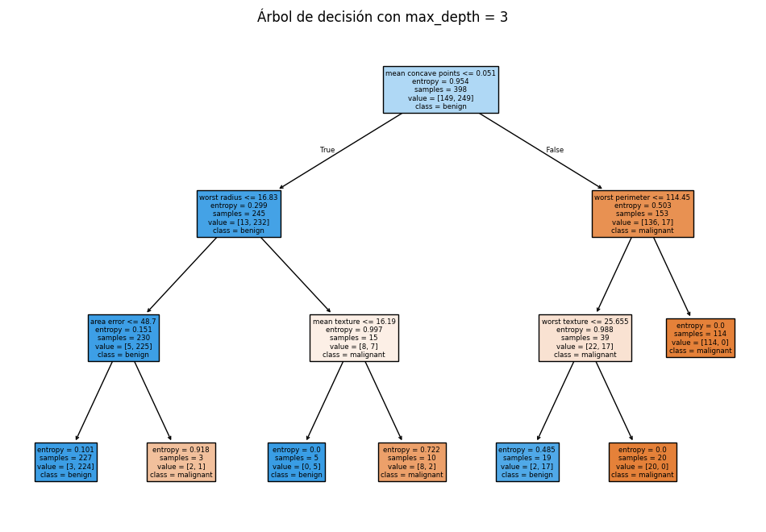

# 🌟 Análisis del Overfitting y Underfitting en Árboles de Decisión con el Dataset de Cáncer de Mama

Este proyecto explora cómo la profundidad de un árbol de decisión afecta su rendimiento y cómo puede llevar a problemas de **overfitting** y **underfitting**. Utilizando el **Breast Cancer Wisconsin Dataset**, entrenamos varios modelos de árboles de decisión con diferentes profundidades y analizamos su precisión en los conjuntos de datos de entrenamiento y prueba.


## 📚 Introducción

En machine learning, es crucial encontrar un equilibrio entre un modelo que sea lo suficientemente flexible para capturar patrones en los datos (sin sobreajustarse) y lo suficientemente simple para generalizar bien a datos nuevos. Este proyecto se enfoca en:

- **Entrenar modelos de árboles de decisión** con diferentes profundidades.
- **Evaluar el rendimiento** de cada modelo en términos de precisión en el conjunto de datos de entrenamiento y prueba.
- **Visualizar los resultados** para entender mejor el comportamiento del modelo y los riesgos de **overfitting** y **underfitting**.

## 🚀 Requisitos

Para ejecutar este proyecto, necesitas tener instalado:

- **Python 3.x**
- **scikit-learn**
- **pandas**
- **matplotlib**
- **prettytable**

Puedes instalar todas las dependencias necesarias ejecutando:

```bash
pip install -r requirements.txt
```

## 💻 Cómo Ejecutar el Proyecto

1. **Clona este repositorio** en tu máquina local:

    ```bash
    git clone https://github.com/DiegoLerma/breast-cancer-decision-tree.git
    ```

2. **Navega al directorio del proyecto:**

    ```bash
    cd breast-cancer-decision-tree
    ```

3. **Abre el Jupyter Notebook en Visual Studio Code o cualquier entorno compatible:**

    ```bash
    code .
    ```

4. **Ejecuta el código en el Notebook** y observa los resultados en cada celda.

## 📊 Resultados del Análisis

Durante el entrenamiento, se probaron diferentes profundidades de árbol, desde 2 hasta 10 niveles. Los resultados obtenidos fueron los siguientes:

```plaintext
+-----------+--------------------+----------------+---------------+
| Max Depth | Number of Features | Train Accuracy | Test Accuracy |
+-----------+--------------------+----------------+---------------+
|     2     |         30         |     0.9271     |     0.9181    |
|     3     |         30         |     0.9799     |     0.9708    |
|     4     |         30         |     0.9925     |     0.9591    |
|     5     |         30         |     0.9925     |     0.9532    |
|     6     |         30         |     0.9975     |     0.9532    |
|     7     |         30         |      1.0       |     0.9649    |
|     8     |         30         |      1.0       |     0.9649    |
|     9     |         30         |      1.0       |     0.9649    |
|     10    |         30         |      1.0       |     0.9649    |
+-----------+--------------------+----------------+---------------+
```

### 📈 Interpretación de Resultados

- **Underfitting (Subajuste):** Cuando la profundidad del árbol es baja (por ejemplo, `max_depth=2`), el modelo no captura completamente la complejidad de los datos, lo que resulta en una precisión subóptima tanto en el conjunto de entrenamiento como en el de prueba.

- **Equilibrio Ideal:** Se observa un buen equilibrio en `max_depth=3`, donde la precisión en el conjunto de prueba es alta y el modelo no está sobreajustado. Aquí, el modelo captura bien los patrones subyacentes en los datos sin ajustarse demasiado a las particularidades del conjunto de entrenamiento.

- **Overfitting (Sobreajuste):** A medida que aumentamos la profundidad del árbol (por ejemplo, `max_depth=7` y superior), el modelo comienza a sobreajustarse. Esto se evidencia por la precisión perfecta en el conjunto de entrenamiento (`1.0`), pero una ligera disminución en la precisión del conjunto de prueba. Esto indica que el modelo ha aprendido demasiado bien los detalles y el ruido del conjunto de entrenamiento, lo que perjudica su capacidad de generalización.

## 🧠 Conceptos Clave

### Overfitting y Underfitting

- **Overfitting:** Ocurre cuando el modelo es demasiado complejo y ajusta incluso el ruido en los datos de entrenamiento. Aunque el modelo muestra alta precisión en el conjunto de entrenamiento, su rendimiento en datos nuevos es pobre.

- **Underfitting:** Ocurre cuando el modelo es demasiado simple para capturar las relaciones subyacentes en los datos. Esto lleva a una baja precisión tanto en el conjunto de entrenamiento como en el de prueba.

### Importancia de las Condiciones de Paro

Establecer condiciones de paro adecuadas, como limitar la profundidad máxima de un árbol de decisión, es crucial para evitar el overfitting. Es importante monitorear la precisión en los conjuntos de datos de entrenamiento y prueba para determinar el punto óptimo donde el modelo generaliza mejor.

## 🔍 Visualización del Árbol de Decisión

Visualizar el árbol de decisión puede ayudar a entender cómo se toman las decisiones en diferentes niveles de profundidad. Puedes ejecutar el siguiente código en tu notebook para ver cómo se ven los árboles entrenados:

```python
from sklearn.tree import plot_tree
import matplotlib.pyplot as plt

for depth in range(3,10,2):
    clf = DecisionTreeClassifier(max_depth=depth, random_state=42)
    clf.fit(X_train, y_train)
    
    plt.figure()
    plot_tree(clf, filled=True, feature_names=data.feature_names, class_names=data.target_names)
    plt.title(f"Decision Tree with max_depth={depth}")
    plt.show()
```

### Este es el ejemplo de uno de los árboles generados:



## 📈 Conclusiones

Este proyecto demuestra la importancia de elegir la profundidad adecuada de un árbol de decisión. Un modelo que es demasiado simple no captura suficiente información (underfitting), mientras que un modelo demasiado complejo captura demasiada información, incluyendo el ruido (overfitting). Es crucial encontrar un equilibrio para asegurar que el modelo generalice bien a nuevos datos.

## 💬 Contribuciones

Si tienes sugerencias, mejoras o deseas reportar algún problema, ¡no dudes en contribuir! Puedes abrir un issue o enviar un pull request.

## 📄 Licencia

Este proyecto está bajo la Licencia MIT. Puedes ver más detalles en el archivo `LICENSE`.

---

*¡Gracias por explorar este proyecto! Esperamos que este análisis te haya ayudado a entender mejor los conceptos de overfitting y underfitting, así como la importancia de establecer condiciones adecuadas para la construcción de modelos de machine learning.*
